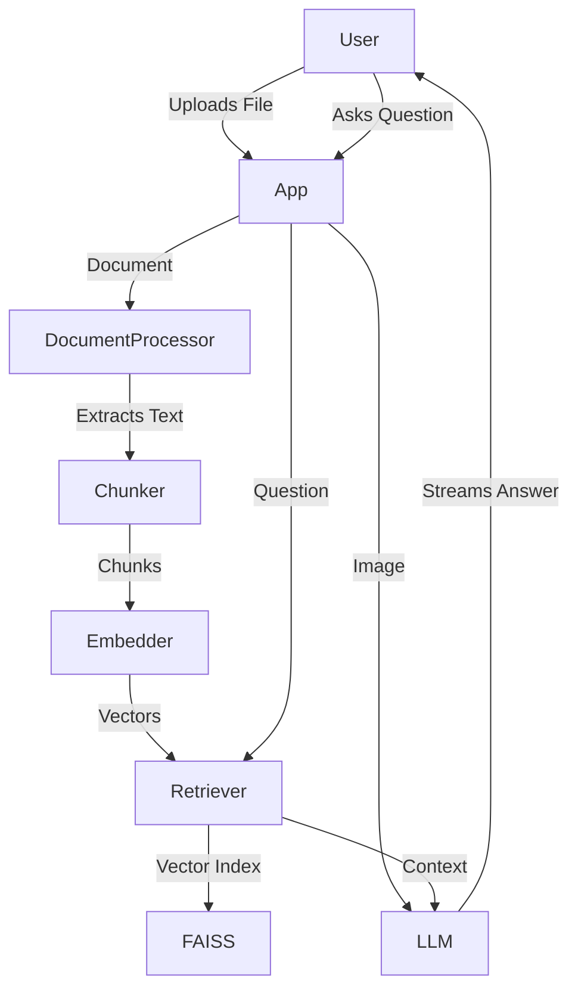

# AuraDocs

AuraDocs is an AI-powered document and image question-answering application. It utilizes a local Retrieval-Augmented Generation (RAG) pipeline to analyze documents and multimodal image understanding.

## Features

- **Multimodal Chat Support**
  - **Document Q&A**: Upload and chat with PDF, TXT, CSV, and Excel (.xlsx/.xls) files.
  - **Image Chat**: Upload PNG, JPG, or WebP images and ask visual questions using Gemini's Vision API.
- **Advanced Retrieval Pipeline**
  - **Smart Chunking**: Documents are split into optimized overlapping chunks (1000 characters with 200 overlap) to preserve context.
  - **Semantic Search**: Text is embedded locally using `all-MiniLM-L6-v2` and searched instantly via a FAISS cosine similarity index.
- **Enterprise-ready UI/UX**
  - **Streaming AI Answers**: Responses stream in real-time, token by token.
  - **Contextual Chat History**: The AI remembers the conversation flow for natural follow-up questions.
  - **Source Transparency**: Expandable citations show exactly which document chunks were used to generate the answer.
  - **Analytics Dashboard**: Monitor system metrics, including files processed, chunk limits, question volume, and average response latency.
- **Resource Management**
  - **Memory Efficiency**: Enforced 10MB upload limits prevent server memory crashes during heavy operation.
  - **Model Caching**: The Heavy ML embedding model is cached on load to ensure instant restarts and zero reloading overhead between sessions.

## Architecture Overview

The system is separated into a clean `core` package and a Streamlit UI, allowing for easy testing and future migration t



## Setup and Installation

### 1. Prerequisites
- Python 3.9+
- A Google Gemini API Key

### 2. Installation
Clone the repository and install the required dependencies:

```bash
git clone https://github.com/saai07/AuraDocs.git
cd AuraDocs
python -m venv env

# Windows
env\Scripts\activate
# Mac/Linux
source env/bin/activate

pip install -r requirements.txt
```

### 3. Configuration
Create a `.streamlit` folder in the root directory and add a `secrets.toml` file to securely store your API key.

```bash
mkdir .streamlit
```

Inside `.streamlit/secrets.toml`, add:
```toml
GOOGLE_API_KEY = "your_actual_gemini_api_key_here"
```
### 4. Running the Application
Start the Streamlit development server:

```bash
streamlit run app.py
```
The application will be available at `http://localhost:8501`.

## Technologies Used

- **Frontend**: Streamlit
- **LLM/Vision Engine**: Google Gemini 2.5 Flash via `google-genai`
- **Embeddings**: SentenceTransformers (`all-MiniLM-L6-v2`)
- **Vector Database**: FAISS CPU
- **Data Parsing**: pdfplumber, pandas, openpyxl
